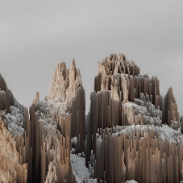

# snort
simple pixel sorter

# usage
`snort <input> <output> <lower bound> <upper bound> [rotations]`

- `input`: the input image
- `output`: the output path
- `lower bound`: only pixels with higher luma values will be sorted
- `upper bound`: only pixels with lower luma values will be sorted
- `rotations` (optional): number of 90-degree rotations to perform before sorting

`lower bound` and `upper bound` accept values from 0 - 255

# example
`snort mountain.jpg example.png 0 120 1`

